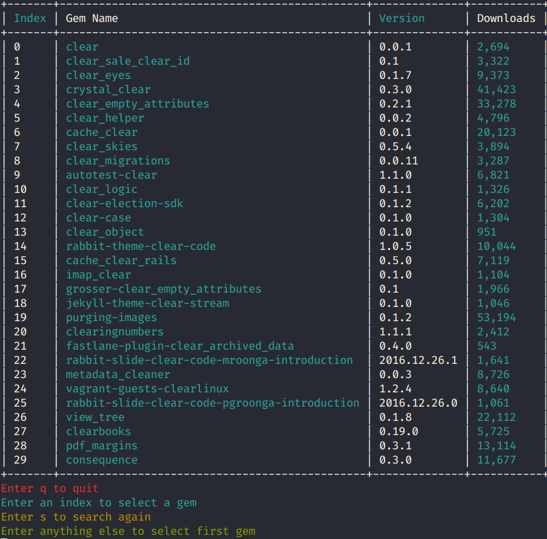
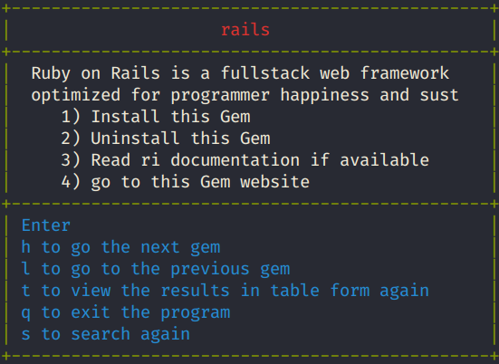

# RUBY CAPSTONE: TREASURY

In this project, I was asked to use ruby for scraping websites and to get information. I decided to get info of ruby gems from rubygems.org. The project is capable of fetching gems right from your terminal.The gems query lists a table of gems sorted on downloads. You can select any gem from the table, scroll between gems, install them, uninstall them,view ri documentation if any or automatically open the website for the gem in the browser all right from one simple menu. Now you can view available gems for your next passion project.

## Project Features

- Search for ruby gems right from your terminal.
- Table menu listing fetched gems for easy selection.
- Table sorted on downloads for easy decision making.
- Critical information such as version and downloads.
- Easily select any gem from the list or option to search again.
- Gem Menu for the Ruby Gem where you can easily install or uninstall the gem.
- Short description for the gem.
- View Additional information from ri documentation for the gem from the terminal and open the rubyorgs.org gem documentation in a browser window.
- Scroll between gems.
- Intuitive menus for the ruby gem and table of gems for easy selection and navigation.

### Project Demo

  

## Project Instructions

## Built With
- Ruby

## Gems Used

- 'launchy'
- 'rspec'
- 'rubocop'
- 'terminal-table'
- 'colorize'

## Getting Started
To get a local copy up and running follow these simple example steps.

### Prerequisites
- Text editor
- GitHub
- Git
- Ruby

### Setup
Clone repository from github to your local drive by following these steps:
- Go to the main page of the repository
- Above the listed files, click the green Code button
- You can clone the repository using:
  - SSH: `git@github.com:SamroodAli/treasury.git`.
- Open Terminal
- Change the current working directory to the location you want the cloned directory
- Type one of the git clone commands listed above.
- Press Enter to create your local clone

### Install
- Install Atom or Microsoft Visual Studio text editor to view the code on your local machine.
- Install Git.

## Running the Project
- Open your terminal
- Navigate to project directory
- Enter `ruby ./bin/main.rb` in your terminal and press Enter.
- Enter your keyword(s) for the gems, example: terminal colors
- If no gems are found, you can try again with other keywords
- Or press `q` to exit

- If there are gems, it would be listed in a table with instructions below
### Table interface

- There are four columns with index, name of the gem, version and the number of downloads.
* Select any gem by entering the index from the gem in the first column.
* Enter `s` to search again.
* Enter `q` to quit
* Entering anything else would open the first gem
* Opening a gem will open the Gem menu

### Gem Menu

- In the top is the name of the gem
- The body has the description followed by four options
#### Options for the gem
1. Enter `1` will install the gem
2. Enter `2` to uninstall the gem
3. Enter `3` to view any ri documentation if there any. ri documentations are terminal documentations that ships with some gems.
4. Launch a browser and open the website for the gem in rubygems.org,you can read more about the gem here.

#### Navigating from the Gem Menu
- The footer has the options for navigating around the program.
- Enter `h` to go to previous gem
- Enter `l` to go the next gem. (My personal favourites)
- Enter `t` to go back to table menu
- Enter `q` to exit
- Enter `s` to search for other gems.

#### Caution
Opening a broswer might put your terminal in waiting mode for the browser to close, You can close your terminal by pressing Control button and C together. It is also safe to exit the terminal now.

## Author

👤 SAMROOD ALI

- GitHub: [@SamroodAli](https://github.com/SamroodAli)
- LinkedIn: [Samrood Ali](https://www.linkedin.com/in/samrood-ali/)

## 🤝 Contributing

Contributions, issues, and feature requests are welcome!

Feel free to check the [issues page](https://github.com/amiraabouhadid/project3_tictactoe/issues).

## Show your support

Give a ⭐️ if you like this project!

## 📝 License

- This project is [MIT](https://opensource.org/licenses/MIT) licensed.
- This project is [creativecommons](https://creativecommons.org/licenses/by-nc/4.0/) licensed.
